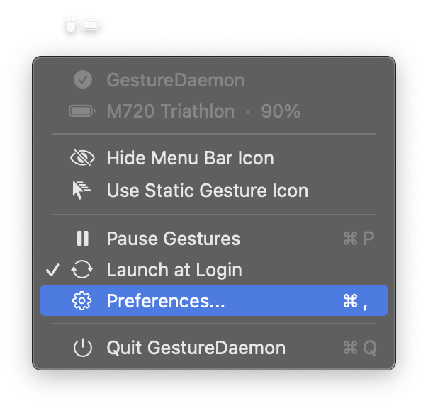
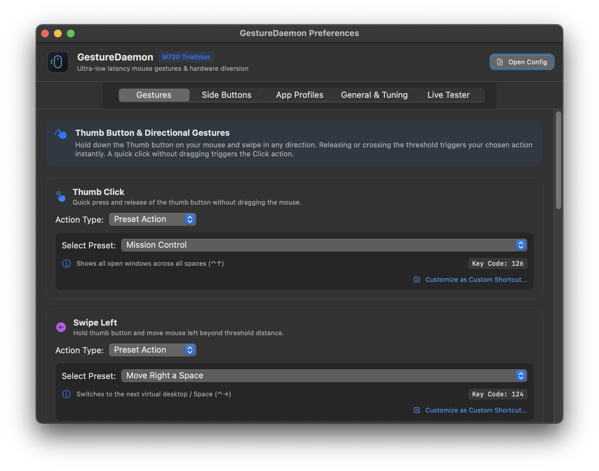
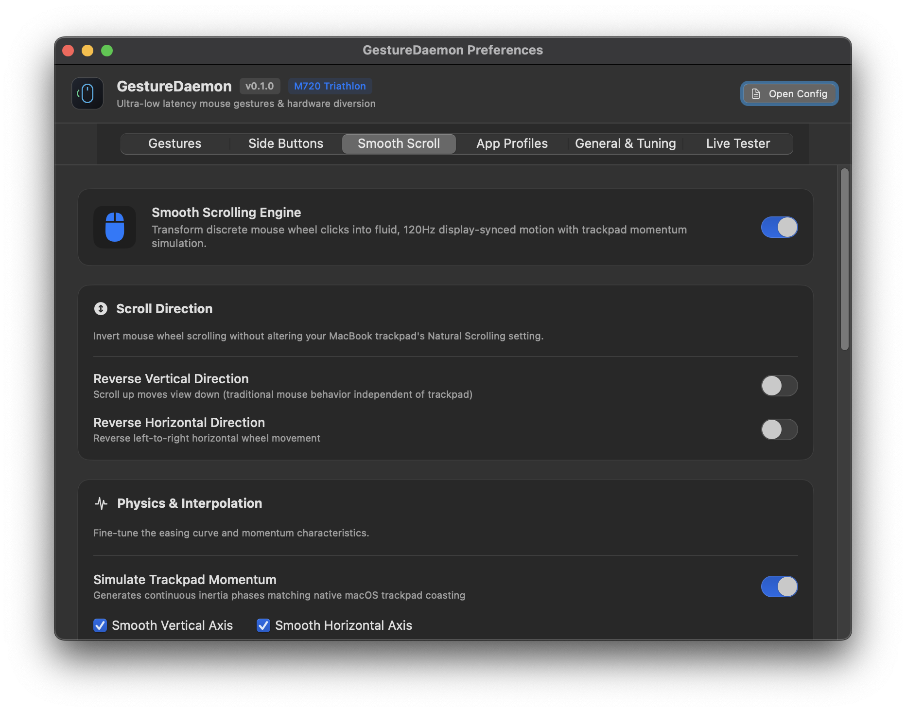
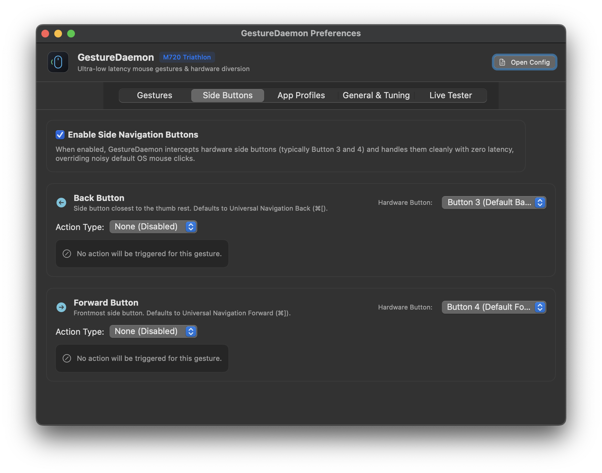
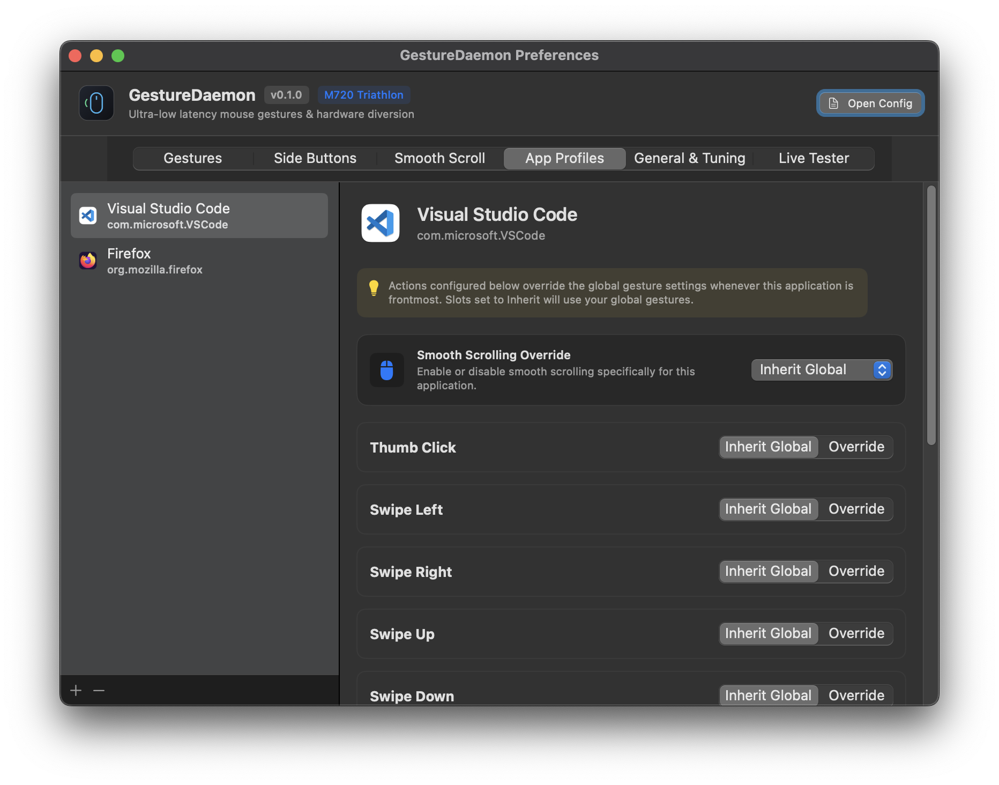
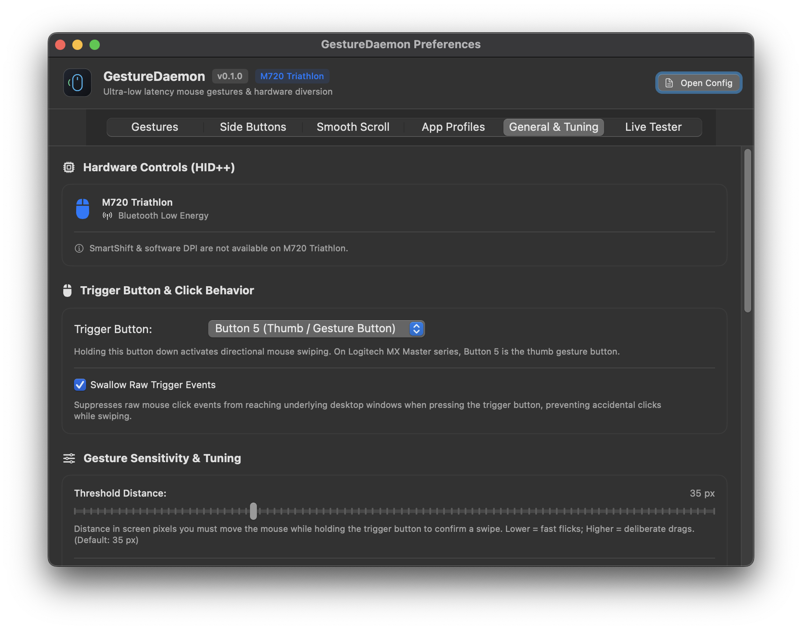
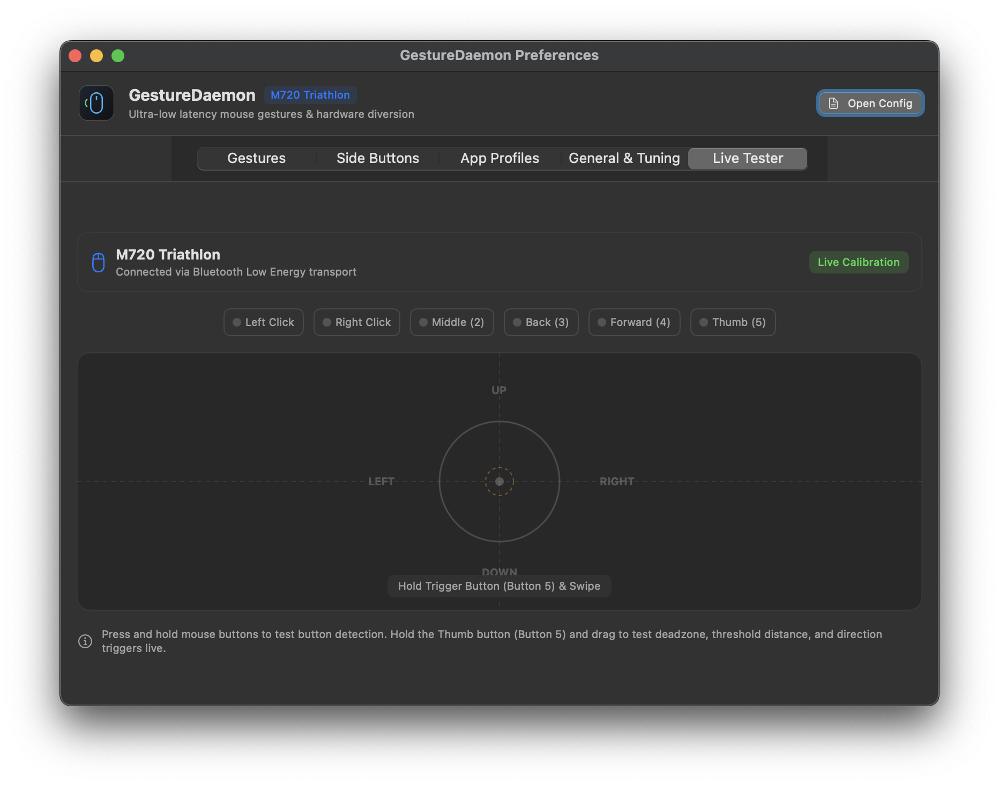

# GestureDaemon 🪟🖱️

[](https://github.com/adaskar/GestureDeamon/releases/tag/v1.0.0)
[](https://www.apple.com/macos/)
[](https://developer.apple.com/swift/)
[-blue?style=flat-square)](https://developer.apple.com)
[](https://github.com/adaskar/GestureDeamon)
[](https://github.com/adaskar/GestureDeamon)
[](https://github.com/adaskar/GestureDeamon)
[](LICENSE)

> **Ultra-lightweight, zero-telemetry native macOS background daemon and menu bar utility replacing Logitech Options+ for multi-button mice.**

Built in 100% pure Swift with **zero external dependencies**. Consumes **0.0% idle CPU** and less than 15 MB of RAM while delivering instant Mission Control, App Exposé, Spaces navigation, **trackpad-quality smooth scrolling**, thumb-scroll volume chording, and universal side-button history controls.

---

## 💡 Why GestureDaemon?

Proprietary mouse suites (such as Logitech Options+ / Logi G HUB) run multi-gigabyte Electron runtimes, background analytics daemons, network telemetry agents, and consume significant CPU and battery life just to intercept a couple of thumb buttons.

**GestureDaemon** replaces the entire bloatware stack with a tiny, standalone native binary (~2 MB):

| Metric | Logitech Options+ | GestureDaemon |
|---|---|---|
| **Idle CPU Usage** | 1% – 5% (constant wakeups) | **0.0%** (zero IPC wakeups via ephemeral taps) |
| **Memory Footprint** | 300 MB – 800 MB+ | **< 15 MB** |
| **Dependencies / Runtimes** | Node.js, Electron, Python, Crashpad | **Zero** (Pure Swift & Apple SPI) |
| **Network Telemetry** | Active tracking & analytics | **100% Offline & Private** |
| **Smooth Scrolling** | None (raw line-scroll ticks) | **CVDisplayLink + Trackpad Phase Simulation** |
| **Preferences & Tuning** | Heavy cloud-synced web UI | **Native SwiftUI Settings (`⌘,`)** + Live Plist Hot-Reload |
| **Calibration & Testing** | None | **Live Visual Calibration Tester Canvas** |
| **Space Transitions** | Emulated keys (frequent escape codes) | Native WindowServer Symbolic HotKeys |
| **Scroll Wheel Chording** | Complex / Laggy | **Native HUD Volume Up / Down (Instant & Zero Jitter)** |
| **Battery Monitoring** | High-overhead polling service | Native HID++ 2.0 (`0x1000`/`0x1004`) in Menu Bar |

---

## 📸 Interface & Screenshots

| Menu Bar & Telemetry | Gestures Configuration |
|:---:|:---:|
| <br><sub>**Status Menu**: Instant battery percentage, charging indicator, pause toggle & quick settings</sub> | <br><sub>**Gestures Tab**: Directional flick triggers, Spaces switching & HUD volume chording</sub> |

| Smooth Scrolling Configuration | Side Buttons Customization |
|:---:|:---:|
| <br><sub>**Smooth Scrolling Tab**: Inertia duration, speed multiplier, deadzone & trackpad phase simulation</sub> | <br><sub>**Side Buttons Tab**: Buttons 3 & 4 history navigation with interactive shortcut recorder</sub> |

| App-Specific Profiles | General Tuning & Sensitivity |
|:---:|:---:|
| <br><sub>**App Profiles Tab**: Context-aware gesture, button, and smooth scroll overrides per application</sub> | <br><sub>**General Tuning**: Sub-pixel sensitivity, deadzone, timing window & icon styles</sub> |

| Live Visual Calibration Canvas |
|:---:|
| <br><sub>**Live Tester Canvas**: Real-time cursor displacement vectors, threshold rings & live gesture detection</sub> |

---

## ✨ Features

- ⚡️ **True 0.0% Idle CPU**: Ephemeral event-tap lifecycle guarantees zero IPC wakeups and zero context switches during normal mouse and trackpad pointer motion.
- 🖱 **Native Smooth Scrolling** *(New in v0.1.0)*: CVDisplayLink-based smooth scrolling engine transforms choppy discrete mouse-wheel ticks into fluid, momentum-aware inertia scrolling that is visually indistinguishable from a trackpad. Emits correctly sequenced macOS scroll phase values (`scrollWheelEventScrollPhase` / `scrollWheelEventMomentumPhase`) so apps with kinetic deceleration (Safari, Maps, PDFs, Xcode canvas) work naturally. Configurable speed, duration, dead-zone, and step normalization. Modifier shortcuts: `Option` for 5× dash scroll, `Shift` to redirect vertical to horizontal, `Command` to bypass. Automatic pass-through for remote desktop clients (TeamViewer, AnyDesk, Parsec, RustDesk, and more).
- 🪟 **Fluid Spaces & Mission Control Transitions**: Uses reverse-engineered Apple CoreGraphics Services (CGS) SPI with `NX_SECONDARYFNMASK` modifier injection for flawless native Desktop switching.
- 🎯 **Native Dock Integration**: Instant Mission Control and App Exposé via private `CoreDockSendNotification`.
- 🔊 **Thumb Gesture + Scroll Wheel Chording**: Hold the thumb button and scroll the wheel to instantly adjust **System Volume Up/Down** with native macOS bezel HUD overlays. Swallows scroll events cleanly so pages never jitter.
- 🎛 **Native SwiftUI Preferences (`⌘,`)**: Full graphical settings interface with 6 tabs: **Gestures**, **Side Buttons**, **App Profiles**, **Smooth Scrolling**, **General & Tuning**, and an interactive **Live Calibration Canvas**.
- 🧪 **Live Tester Canvas**: Real-time visual feedback showing mouse cursor displacement vectors, threshold & deadzone boundary rings, button press state badges, and live gesture recognition.
- ⌨️ **Interactive Shortcut Recorder**: Effortlessly record custom shortcuts with automatic layout normalization across international keyboards (QWERTY, AZERTY, Turkish Q, Colemak, etc.).
- 🔋 **Live Battery & Hardware Telemetry**: Native Logitech HID++ 2.0 query engine (`0x1000`/`0x1004`) reports mouse battery health (`Good`, `Full`, `Low`, `Critical`) and charging state directly in the macOS menu bar and preferences. Accurately handles both continuous fuel-gauge percentage and stepped voltage comparators (e.g. M720, MX Master series), fully preserved across system sleep, screen dimming, and display lock.
- 🧼 **Modifier Sanitization**: Unconditionally swallows Logitech's hardware fallback `Cmd+Option+Tab` thumb macro and flushes system modifiers—preventing VS Code or browser tab bars from stealing focus.
- 🧭 **Universal Side Navigation (Back & Forward)**: Translates side buttons (Buttons 3 & 4) into instant history navigation (`Cmd+[` / `Cmd+]`) across Safari, Chrome, and Finder, with smart IDE navigation (`Ctrl+-` / `Ctrl+Shift+-`) in Visual Studio Code.
- 📱 **Per-Application Contextual Profiles**: Dynamically override gestures, button bindings, and smooth scrolling behaviour based on the active foreground application.
- 🎛 **Live Hot-Reloading (`config.plist`)**: Edit your configuration in `~/.config/GestureDaemon/config.plist` and changes take effect immediately without restarting the daemon.
- 🍏 **Modern macOS Agent**: Native `.app` bundle with `LSUIElement=true`, status bar controller (`NSStatusItem`), customizable menu bar styles ("standard", "battery", "batteryWithPercentage", "hidden"), and modern `SMAppService` launch-at-login integration.
- 📡 **Dual-Transport HID++ (USB & Direct Bluetooth LE)**: Seamlessly detects and controls Logitech mice over USB Unifying/Bolt receivers (`0xFF00`) or direct **Bluetooth Low Energy** connections (`0xFF43:0x0202`), automatically diverting the thumb button with zero setup.
- 🌙 **Sleep / Wake & Power Resilience**: Intelligent power management (`SleepWakeManager`) that distinguishes full ACPI system sleep from display sleep and session lock transitions. Keeps active Bluetooth channels alive during display dimming, debounces wake and unlock events, flushes stale handles on ACPI wake, and seamlessly re-diverts hardware buttons while maintaining uninterrupted battery telemetry.
- 🪵 **Built-in Diagnostic Logging**: Real-time event tracking and live logging at `~/.config/GestureDaemon/daemon.log` for easy troubleshooting.

---

## 🚀 Installation

### Option 1: Build from Source (Recommended)

Compiling locally builds a native application specifically signed for your machine. Because it is compiled locally, macOS Gatekeeper permits execution immediately without quarantine restrictions.

```bash
# 1. Clone the repository
git clone https://github.com/adaskar/GestureDeamon.git
cd GestureDeamon

# 2. Build universal binary and install directly to /Applications
make install
```

#### Architecture-Specific Build Targets
You can package the application bundle for specific architectures or both:

- **Universal (Both Apple Silicon & Intel)**:
  ```bash
  make app
  ```
- **Apple Silicon (M1 / M2 / M3 / M4 - arm64)**:
  ```bash
  make app-arm64
  ```
- **Intel (x86_64)**:
  ```bash
  make app-x86_64
  ```

To build a distributable disk image:
```bash
make dmg
# Result: build/GestureDaemon.dmg
```

Once installed, launch **GestureDaemon** from `/Applications` or Spotlight, grant Accessibility in **System Settings → Privacy & Security → Accessibility**, and click the menu bar icon to enable **Launch at Login**.

---

### Option 2: Pre-built Disk Image (`GestureDaemon.dmg`)

> [!NOTE]
> **Gatekeeper & Developer Verification Required**:
> Because GestureDaemon is an open-source, non-commercial project developed without an Apple Developer Program subscription ($99/yr), releases are ad-hoc codesigned. When downloaded via a browser, macOS will quarantine the bundle and prevent immediate opening (*"cannot be opened because Apple cannot check it for malicious software"*).

#### Step-by-Step Installation:
1. Download **`GestureDaemon.dmg`** from the [Releases](https://github.com/adaskar/GestureDeamon/releases) page.
2. Double-click the DMG and drag **`GestureDaemon.app`** into your `/Applications` folder.
3. Attempt to launch **GestureDaemon** once from `/Applications` or Spotlight (you will see the Gatekeeper prompt; click **Done** or **Cancel**).
4. Authorize the application:
   - **Method A (System Settings GUI)**:
     1. Open **System Settings** → **Privacy & Security**.
     2. Scroll down to the **Security** section.
     3. You will see: *"GestureDaemon.app was blocked from use because it is not from an identified developer"*.
     4. Click **"Open Anyway"** and confirm with your password or Touch ID.
   - **Method B (Terminal Quick-Fix)**:
     Strip the quarantine attribute directly:
     ```bash
     xattr -cr /Applications/GestureDaemon.app
     ```
     Then launch normally:
     ```bash
     open /Applications/GestureDaemon.app
     ```
5. When prompted, grant Accessibility in **System Settings → Privacy & Security → Accessibility** (and Input Monitoring if using direct Bluetooth LE).
6. Click the menu bar icon or press `⌘,` to configure your preferences and enable **Launch at Login**.

---

## 🎮 Default Controls & Gestures

Optimized out-of-the-box for multi-button mice including the **Logitech M720 Triathlon**, **MX Master 2S / 3 / 3S**, and standard 5-button mice:

### 1. Thumb Button Gestures & Wheel Chording

Hold the **Thumb Gesture Button** (or wrist-flick / scroll) and release:

```
                    ▲
             [ Mission Control ]
                    |
[ Space Right ] ◀── ● ──▶ [ Space Left ]
  (Flick Left)      |     (Flick Right)
                    ▼
               [ App Exposé ]

  ═════════════════════════════════════
  [Thumb + Scroll Up]   ▲  Volume Up   (Native HUD)
  [Thumb + Scroll Down] ▼  Volume Down (Native HUD)
```

| Action Trigger | Default Action | Technical Implementation |
|---|---|---|
| **Stationary Tap / Click** | **Mission Control** | `CoreDockSendNotification("com.apple.expose.awake")` |
| **Wrist-Flick Left** | **Switch to Right Space** | CGS Symbolic HotKey `81` (`Ctrl + Right`) |
| **Wrist-Flick Right** | **Switch to Left Space** | CGS Symbolic HotKey `79` (`Ctrl + Left`) |
| **Wrist-Flick Down** | **App Exposé** | `CoreDockSendNotification("com.apple.expose.front.awake")` |
| **Thumb + Scroll Up** | **Volume Up** | Native macOS Media Key `NX_KEYTYPE_SOUND_UP` with bezel HUD |
| **Thumb + Scroll Down** | **Volume Down** | Native macOS Media Key `NX_KEYTYPE_SOUND_DOWN` with bezel HUD |

*Default Timing: 75 ms evaluation window. Threshold: 35 pt. Deadzone: 8 pt.*

### 2. Side Navigation Buttons

| Physical Button | Button Index | Default Target Action |
|---|---|---|
| **Back Button** | `3` | **Navigate Back**: Browser / Finder (`Cmd + [`), VS Code (`Ctrl + -`) |
| **Forward Button** | `4` | **Navigate Forward**: Browser / Finder (`Cmd + ]`), VS Code (`Ctrl + Shift + -`) |

---

## 🖥️ Preferences & Live Calibration

Press **`⌘,`** or click **Preferences...** in the menu bar to open the native SwiftUI settings window:

- **Gestures Tab**: Configure actions for Click, Drag Left, Drag Right, Drag Up, Drag Down, Scroll Up, and Scroll Down.
- **Side Buttons Tab**: Customize Back and Forward buttons with custom key shortcuts, application launches, or terminal commands.
- **App Profiles Tab**: Set custom per-application overrides (e.g. tab cycling in Safari, timeline scrubbing in video editors, terminal toggling in VS Code). Smooth scrolling can be disabled per-app from this tab.
- **Smooth Scrolling Tab** *(New in v0.1.0)*:
  - Enable / disable smooth scrolling globally or toggle it from the menu bar.
  - Speed multiplier, inertia duration slider, dead-zone threshold, and step normalization.
  - Per-axis toggles (smooth vertical, smooth horizontal, reverse vertical, reverse horizontal).
  - Trackpad phase simulation toggle (emits `scrollWheelEventScrollPhase` for apps with kinetic deceleration).
- **General & Tuning Tab**:
  - Sensitivity sliders: Drag Threshold (points), Deadzone Radius (points), Gesture Timing Window (ms).
  - Launch at Login toggle (`SMAppService`).
  - Menu Bar style selector: `Standard`, `Mouse + Battery Icon`, `Battery Icon + Percentage`, or `Hidden`.
  - Diagnostics and Log Level selection (`Debug`, `Info`, `Error`, `None`).
  - Real-time macOS Accessibility & Input Monitoring permission badges with one-click fix buttons.
- **Live Tester Tab**:
  - Interactive real-time canvas visualizing cursor motion vectors, deadzone ring, threshold boundary, button states, gesture direction resolution, and scroll chording feedback.

---

## ⚙️ Configuration File (`config.plist`)

All preferences are stored in a human-readable property list at:
```bash
~/.config/GestureDaemon/config.plist
```

To edit it anytime, click the Menu Bar icon and select **Open Configuration File...**, or edit in your terminal:
```bash
open -e ~/.config/GestureDaemon/config.plist
```

> **Hot-Reloading**: GestureDaemon monitors the file descriptor. The millisecond you save changes, settings are applied live without needing to restart the daemon. Any change made in the SwiftUI Preferences GUI automatically synchronizes with `config.plist`.

### Example: Customizing Gestures & Wheel Chording

```xml
<?xml version="1.0" encoding="UTF-8"?>
<!DOCTYPE plist PUBLIC "-//Apple//DTD PLIST 1.0//EN" "http://www.apple.com/DTDs/PropertyList-1.0.dtd">
<plist version="1.0">
<dict>
    <key>TriggerButtonIndex</key><integer>5</integer>
    <key>ThresholdDistance</key><real>35.0</real>
    <key>DeadzoneRadius</key><real>8.0</real>
    <key>GestureWindowMs</key><real>75.0</real>
    <key>ShowMenuBarIcon</key><true/>
    <key>MenuBarIconStyle</key><string>standard</string>

    <!-- Thumb + Scroll Wheel Chording Actions -->
    <key>ScrollUpAction</key>
    <dict>
        <key>Type</key><string>System</string>
        <key>SystemAction</key><string>VolumeUp</string>
        <key>Comment</key><string>Volume Up</string>
    </dict>
    <key>ScrollDownAction</key>
    <dict>
        <key>Type</key><string>System</string>
        <key>SystemAction</key><string>VolumeDown</string>
        <key>Comment</key><string>Volume Down</string>
    </dict>

    <!-- Per-Application Overrides -->
    <key>Applications</key>
    <dict>
        <!-- Safari: Flick Left/Right cycles tabs instead of switching Spaces -->
        <key>com.apple.Safari</key>
        <dict>
            <key>DragLeftAction</key>
            <dict>
                <key>Type</key><string>Shortcut</string>
                <key>KeyCode</key><integer>33</integer>
                <key>Modifiers</key><array><string>Command</string><string>Shift</string></array>
                <key>Comment</key><string>Previous Tab (Cmd+Shift+[)</string>
            </dict>
            <key>DragRightAction</key>
            <dict>
                <key>Type</key><string>Shortcut</string>
                <key>KeyCode</key><integer>30</integer>
                <key>Modifiers</key><array><string>Command</string><string>Shift</string></array>
                <key>Comment</key><string>Next Tab (Cmd+Shift+])</string>
            </dict>
        </dict>
    </dict>
</dict>
</plist>
```

---

## 🔍 Diagnostics & Troubleshooting

GestureDaemon provides optional diagnostic logging (disabled by default for zero disk I/O and zero idle CPU) and an interactive CLI diagnostic mode:

### 1. View Live Event Logs
To activate file logging, set `<key>EnableLogging</key><true/>` in `~/.config/GestureDaemon/config.plist` (or select `Debug` in the Preferences window). Then monitor in real time:
```bash
tail -f ~/.config/GestureDaemon/daemon.log
```

### 2. Run Interactive Hardware Diagnostics
To inspect raw mouse button numbers, modifier keycodes, and HID reports from your physical hardware:
```bash
make diagnose
# Or directly:
/Applications/GestureDaemon.app/Contents/MacOS/GestureDaemon --diagnostics
```

### 3. Recover Hidden Menu Bar Icon
If you hid the status bar icon, simply launch **GestureDaemon** again from `/Applications` or Spotlight, or press `⌘,` if the app is active. The running daemon will wake up, temporarily restore the menu bar item, and display the menu.

---

## 📚 Complete Documentation

For architectural deep-dives, HID++ 2.0 transport internals, parameter dictionaries, virtual keycode lookup tables, and the upcoming feature roadmap, see:

📖 **[Full Architecture & Configuration Guide (DOCUMENTATION.md)](DOCUMENTATION.md)**

---

## 🤝 Contributing

Contributions, bug reports, and feature suggestions are welcome!
1. Fork the repository (`https://github.com/adaskar/GestureDeamon`)
2. Create your feature branch (`git checkout -b feature/my-new-feature`)
3. Commit your changes (`git commit -am 'Add some feature'`)
4. Push to the branch (`git push origin feature/my-new-feature`)
5. Open a Pull Request

---

## 📄 License

This project is licensed under the **MIT License** - see the [LICENSE](LICENSE) file for details.
